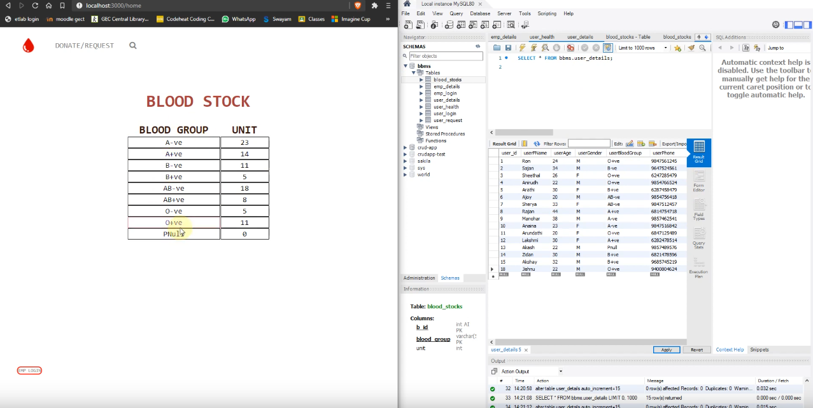

# Blood Bank App

A simple web application for managing a blood bank. The app delivers functionalities that makes it easy 
for managment of a blood bank.



The Application was build using following technologies: 
- ReactJs
- JavaScript
- NodeJs
- MySQL

## Diagrams
<p align="center">
 
</p>

## Deployment

Click [me](https://lonebots.github.io/blood-bank-app/) for the live demo (several functionalites may be unavailabe since its statically hosted).\
Watch the detailed explanation about the app [here](https://youtu.be/LRvpY_4qsOk)

## Features

The app incorportate following feature for different it twow categories of user: 

#### User
- Register & Login
- donate blood 
- request blood 

#### Employee
- Register & Login
- Update blood stocks
- update user health
- Handle blood request

#### General
- Search - based on blood group or location


## Run Locally

Clone the project

```bash
  git clone https://github.com/lonebots/blood-bank-app.git
```

Open MySQL WorkBench and run the `database.sql` file. 

To start the server

```bash
  cd server             
  yarn install 
  yarn devStart          
```

To start the client

```bash
  cd client
  yarn install
  yarn start
```


## License

[MIT](https://choosealicense.com/licenses/mit/)


## Contributing

Contributions are always welcome!

See `contributing.md` for ways to get started.

Please adhere to this project's `code of conduct`.


## Authors

- [@lonebots](https://www.github.com/lonebots)

<br/>
<br/>
<p align=center>
<b>Made with ❤️ | leave a ⭐ if you loved the project</b>
<br/>
<br/>
<br/>
<a href="https://www.buymeacoffee.com/lonebots"></a>
</p>
